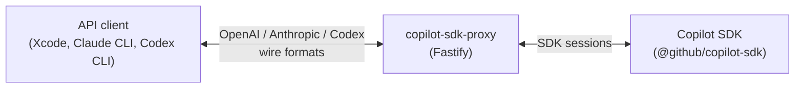
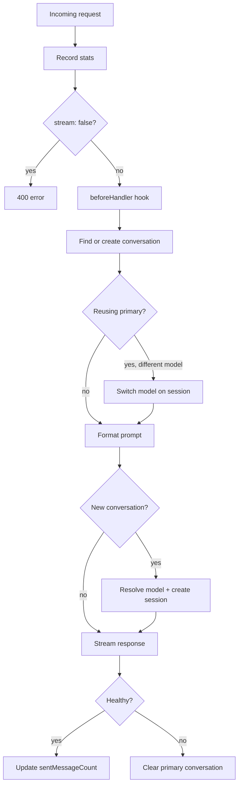
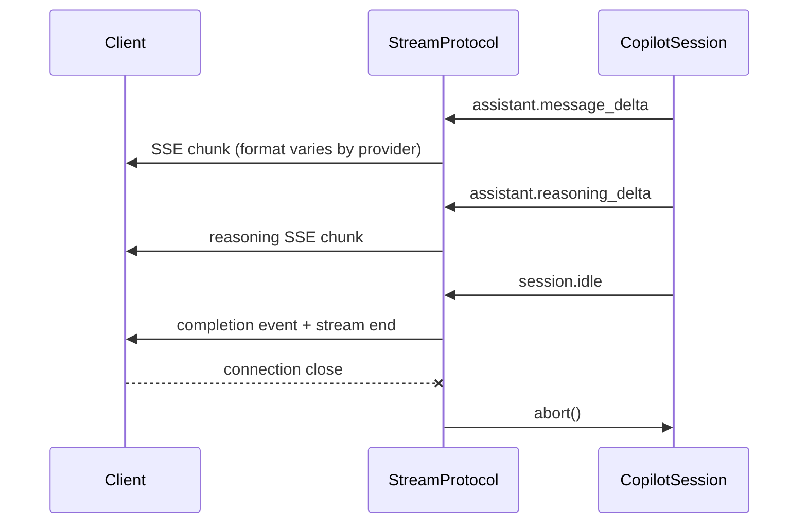

# copilot-sdk-proxy architecture

A proxy server that sits between API clients and the GitHub Copilot SDK. Clients send requests using OpenAI, Anthropic, or Codex wire formats and the proxy translates them into Copilot SDK sessions, streaming responses back in the matching protocol.



## Startup

[`cli.ts`](src/cli.ts) is the entry point. It parses CLI flags with Commander, boots the Copilot SDK, checks auth, creates the Fastify server, and handles graceful shutdown (SIGINT/SIGTERM/idle timeout). The `--provider` flag picks a single provider or defaults to `auto`, which registers all three.

[`CopilotService`](src/copilot-service.ts) wraps the SDK's `CopilotClient`. It handles `start()`/`stop()`, auth checks, model listing (cached for 30 minutes), and session creation. Every other part of the codebase talks to the SDK through this wrapper.

[`createServer()`](src/server.ts) builds the Fastify instance with CORS, a `/health` endpoint, and whatever routes the chosen provider registers.

## Provider system

A provider is anything that satisfies the [`Provider`](src/providers/types.ts) interface: a name, a list of route strings (for the startup banner), and a `register()` method that attaches Fastify routes.

Three providers ship out of the box:

| Provider | Routes | Wire format |
| -------- | ------ | ----------- |
| [`openaiProvider`](src/providers/openai/provider.ts) | `GET /v1/models`, `POST /v1/chat/completions` | OpenAI Chat Completions |
| [`claudeProvider`](src/providers/claude/provider.ts) | `POST /v1/messages`, `POST /v1/messages/count_tokens` | Anthropic Messages |
| [`codexProvider`](src/providers/codex/provider.ts) | `POST /v1/responses` | OpenAI Responses |

Each provider creates its own [`DefaultConversationManager`](src/conversation-manager.ts) and registers route handlers during `register()`.

[`createAutoProvider()`](src/providers/index.ts#L18) combines all three into a single provider. It registers each in a separate Fastify scope with its own per-provider config, so MCP servers and tool allowlists can differ between providers.

## Request lifecycle

Every request goes through [`runHandlerPipeline()`](src/providers/shared/handler-core.ts#L38). The pipeline is generic over the request type and composed of pluggable steps:



Each provider fills in the pipeline's abstract slots -- `extractSystemMessage`, `formatPrompt`, `messageCount`, and `stream` -- with protocol-specific logic. The shared pipeline handles conversation management, model resolution, error recovery, and stats.

## Conversation management

[`DefaultConversationManager`](src/conversation-manager.ts#L21) tracks conversations in a `Map`. There's always at most one **primary** conversation per provider. It holds a long-lived Copilot session (`infiniteSessions: { enabled: true }`) that gets reused across requests.

When a new request arrives, [`findForNewRequest()`](src/conversation-manager.ts#L65) checks if the primary is available. If the primary is busy or gone, it creates an **isolated** conversation instead. Isolated conversations are cleaned up once they finish.

On reuse, only the new messages get sent to the SDK (incremental prompts). `sentMessageCount` tracks how many messages from the conversation history have already been sent, so the prompt formatter can skip them.

If the primary encounters an error, it's cleared and a fresh one gets created on the next request.

## Model resolution

[`resolveModel()`](src/providers/shared/model-resolver.ts#L23) maps requested model IDs to what's actually available in Copilot. It tries three strategies in order:

1. Exact match
2. Normalized match (strips date suffixes, replaces dots with hyphens)
3. Family fallback (finds the closest model in the same family by longest common prefix)

This means a request for `claude-opus-4-6` works even if Copilot only has `claude-opus-4-5-20250501`.

## Streaming

Streaming is where the protocol translation happens. Each provider implements [`StreamProtocol`](src/providers/shared/streaming-core.ts#L7), which defines how to flush text deltas, reasoning deltas, and completion/failure signals to the HTTP response.

[`runSessionStreaming()`](src/providers/shared/streaming-core.ts#L116) wires up the Copilot session's event stream to the protocol:



[`createCommonEventHandler()`](src/providers/shared/streaming-core.ts#L24) handles the events that all three protocols share: buffering text/reasoning deltas, logging tool executions, recording usage stats, and logging context compaction.

The three protocol implementations:

- [`OpenAIProtocol`](src/providers/openai/streaming.ts) -- emits `data: {"choices":[{"delta":{"content":"..."}}]}` chunks, ends with `data: [DONE]`
- [`AnthropicProtocol`](src/providers/claude/streaming.ts) -- emits `message_start`, `content_block_start/delta/stop`, `message_stop` events, with separate thinking blocks for reasoning
- [`ResponsesProtocol`](src/providers/codex/streaming.ts) -- emits `response.created`, `response.output_text.delta`, `response.completed` events, with reasoning summary items

## Session configuration

[`createSessionConfig()`](src/providers/shared/session-config.ts#L19) builds the SDK's `SessionConfig` from the proxy's config. It sets up:

- MCP servers (local stdio or remote HTTP, each with tool allowlists)
- CLI tool authorization via [`onPreToolUse`](src/providers/shared/session-config.ts#L77) hook
- Permission handling via [`onPermissionRequest`](src/providers/shared/session-config.ts#L64) (configurable auto-approve)
- User input requests get a canned refusal (there's no interactive terminal)
- Error retry for recoverable `model_call` and `tool_execution` errors

## Configuration

Config is loaded from a [`config.json5`](config.json5) file. [`resolveConfigPath()`](src/config.ts#L62) checks the project `--cwd` directory, then the process cwd, then falls back to the bundled default. The schema is validated with Zod ([`ServerConfigSchema`](src/schemas/config.ts)).

Per-provider config blocks (`openai`, `claude`, `codex`) allow each provider to have different MCP servers. Shared settings like `allowedCliTools`, `bodyLimit`, `reasoningEffort`, and `autoApprovePermissions` apply across all providers.

## Project layout

```text
src/
|-- cli.ts                          CLI entry point, server lifecycle
|-- server.ts                       Fastify server factory
|-- copilot-service.ts              Copilot SDK wrapper
|-- conversation-manager.ts         Session reuse and lifecycle
|-- config.ts                       Config loading (JSON5 + Zod)
|-- context.ts                      AppContext type
|-- logger.ts                       Leveled logger
|-- stats.ts                        Usage metrics
|-- ui.ts                           Terminal output, spinners, banner
|-- schemas/
|   +-- config.ts                   Zod schemas for config validation
+-- providers/
    |-- types.ts                    Provider interface
    |-- index.ts                    Provider registry, auto mode
    |-- shared/
    |   |-- handler-core.ts         Generic request pipeline
    |   |-- streaming-core.ts       StreamProtocol + event handling
    |   |-- streaming-utils.ts      SSE helpers
    |   |-- session-config.ts       SDK session config builder
    |   |-- model-resolver.ts       Model ID resolution
    |   +-- errors.ts               Error response formatters
    |-- openai/
    |   |-- provider.ts             Route registration
    |   |-- handler.ts              Chat completions handler
    |   |-- streaming.ts            OpenAI SSE protocol
    |   |-- schemas.ts              Request/response types
    |   |-- prompt.ts               Message formatting
    |   +-- models.ts               GET /v1/models handler
    |-- claude/
    |   |-- provider.ts             Route registration
    |   |-- handler.ts              Messages handler
    |   |-- streaming.ts            Anthropic SSE protocol
    |   |-- schemas.ts              Request/response types
    |   |-- prompt.ts               Message formatting
    |   +-- count-tokens.ts         Token counting endpoint
    +-- codex/
        |-- provider.ts             Route registration
        |-- handler.ts              Responses handler
        |-- streaming.ts            Responses SSE protocol
        |-- schemas.ts              Request/response types
        +-- prompt.ts               Message formatting
```
